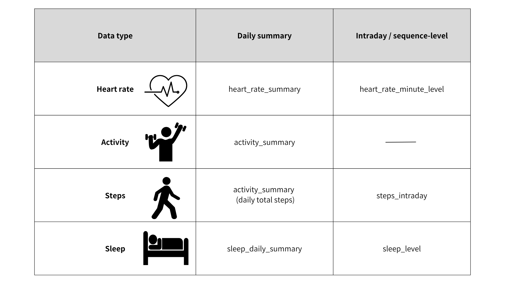

::: {.callout-note}
This is an independently authored, non-peer-reviewed practical guide. It is not an official publication of the All of Us Research Program.
:::

# Objectives

This blog post explains how to use All of Us (AoU) Fitbit data in practice. 
Its main objectives are to:

- introduce useful resources for understanding AoU Fitbit data
- explain the structure of AoU Fitbit datasets
- show how to choose the most appropriate AoU Fitbit dataset for different research questions

# Useful resources

The following publicly available resources provide useful information for understanding AoU Fitbit data.

1. [Data Dictionaries](https://support.researchallofus.org/hc/en-us/articles/360033200232-Data-Dictionaries)
- This resource provides detailed metadata for the All of Us Curated Data Repository (CDR), including variable names, table descriptions, and dataset-specific structure for both Registered Tier and Controlled Tier data. 
- It is the best starting point for checking how each Fitbit-related table is organized in your current data release.

2. [Resources for Using Fitbit Data](https://support.researchallofus.org/hc/en-us/articles/20281023493908-Resources-for-Using-Fitbit-Data)
- This page gives an overview of the Fitbit data available in All of Us, including heart rate, sleep, activity, and device data, and links each BigQuery table to the relevant Fitbit Web API documentation. 
- It is especially useful for understanding what each table measures and for locating table-level information before beginning preprocessing or analysis.

3. [Considerations while Using Fitbit Data in the All of Us Research Program](https://support.researchallofus.org/hc/en-us/articles/9651723386388-Considerations-while-using-Fitbit-Data-in-the-All-of-Us-Research-Program)
- This page summarizes practical issues researchers should consider when analyzing AoU Fitbit data, such as device reliability, adherence, wear time, and preprocessing strategies.
- It is useful for understanding how prior literature has approached valid-day definitions and heart-rate–based adherence filtering, which can help inform analytic decisions in your own study.

# How AoU Fitbit data are organized

This section explains the structure of AoU Fitbit datasets.

Figure 1. Structure of AoU Fitbit datasets by data type and time resolution.

Daily summary tables provide day-level measures, whereas intraday or sequence-level tables provide finer temporal information.

**heart_rate_summary**

- This dataset contains daily summaries of heart rate measures.
- It includes `person_id`, `date`, `zone_name`, `min_heart_rate`, `max_heart_rate`, `minute_in_zone`, `calorie_count`, and `src_id`.

**heart_rate_minute_level**

- This dataset contains minute-level heart rate records.
- It includes `person_id`, `datetime`, `heart_rate_value`, and `src_id`.
- Note that AoU indicates `heart_rate_value` is minute-level for `src_id` = PTSC and second-level for `src_id` = TPC.

**activity_summary**

- This dataset contains daily summaries of activity-related measures.
- It includes `person_id`, `date`, `activity_calories`, `calories_bmr`, `calories_out`, `elevation`, `fairly_active_minutes`, `floors`, `lightly_active_minutes`, `marginal_calories`, `sedentary_minutes`, `steps`, `very_active_minutes`, and `src_id`.

**steps_intraday**

- This dataset contains minute-level step count records.
- It includes `person_id`, `datetime`, `steps`, and `src_id`.

**sleep_daily_summary**

- This dataset contains daily summaries of sleep measures.
- It includes `person_id`, `sleep_date`, `is_main_sleep`, `minute_in_bed`, `minute_asleep`, `minute_after_wakeup`, `minute_awake`, `minute_restless`, `minute_deep`, `minute_light`, `minute_rem`, `minute_wake`, and `src_id`.

**sleep_level**

- This dataset contains sequence-level sleep stage records.
- It includes `person_id`, `sleep_date`, `start_datetime`, `is_main_sleep`, `level`, `duration_in_min`, and `src_id`.

Detailed variable definitions in each dataset are available in the official AoU data dictionary. [@UnknownUnknown-vo]

::: {.callout-note collapse="true"}
1. **heart_rate_minute_level** is named that way now, but AoU says it may be renamed in a future release because the resolution differs by source. Currently, the table contains 1-minute data for one source and 1-second data for another. [@UnknownUnknown-er]

2. `sleep_level` is better described as sequence-level rather than minute-level, because it stores sleep episodes/stages with `start_datetime`, `level`, and `duration_in_min`.

3. For **heart_rate_minute_level** and **steps_intraday**, the default SQL query generated in the All of Us Research Workbench returns daily summarized data rather than minute-level data. For example, queries for steps_intraday may produce daily total steps instead of minute-level step records. To obtain minute-level data, you need to modify the default SQL query.

:::

# Valid-day and valid-night definitions

People often wear Fitbit devices for most of the day, but they may remove them intentionally or unintentionally, such as while showering or charging the device. These periods of nonwear can result in incomplete daily data and should be considered when defining valid observations for analysis.

## Valid days for physical activity analyses

For daily physical activity analyses, sufficient wear time is the primary valid-day criterion. Additional quality-control criteria should be selected according to the physical activity outcome.

### 1. Sufficient wear time

- Daily wear time can be approximated using **heart_rate_minute_level** data. The presence of heart rate data is used as a proxy for device wear rather than a direct measure of wear time. [@Claudel2021-vu]
- A common approach is to require at least 10 hours of heart rate recordings within a day.
    - This criterion can be used when analyzing daytime physical activity outcomes such as daily steps, light activity, and moderate-to-vigorous physical activity (MVPA). [@UnknownUnknown-oe; @Chan2022-os; @Orstad2021-vu; @Claudel2021-vu; @Bailey2025-lj; @Collins2019-iu; @Brewer2017-nf]
- A valid week is often defined as a week containing at least 3 valid days, although the appropriate requirement depends on the research question. [@Chan2022-os]
- Analyses of sedentary time or 24-hour behaviors may require a longer wear-time criterion. [@UnknownUnknown-oe]

### 2. Outcome-specific quality checks

- For daily step-count analyses, wear-time criteria can be supplemented with a plausible daily step-count criterion.
    - Daily steps can be obtained directly from **activity_summary** or calculated by aggregating **steps_intraday** records by person and date.
- The All of Us support guidance gives a threshold of at least 100 steps per day, together with at least 10 hours of wear time, as an example for daily step-count analyses. [@UnknownUnknown-er]
- An upper step-count threshold may also be applied to identify implausibly high values.
    - Published studies have used different upper cutoffs, including <45,000 [@Zheng2026-gn], <50,000 [@Simmering2025-kr; @O-Neill2017-jb], and <100,000 [@Patten2026-ju] steps/day.
- A minimum step count is not generally required for analyses of MVPA or other activity-intensity measures. [@Collins2019-iu; @Brewer2017-nf]
    - For example, zero minutes of MVPA may represent a valid inactive day when sufficient wear time and the required activity-intensity data are available.

## Valid nights for sleep analyses

- Valid-night criteria should be defined separately from valid-day criteria for physical activity.
- A minimal approach is to require at least one Fitbit-designated main sleep episode, identified using `is_main_sleep` in **sleep_daily_summary**. [@Master2025-wi; @Leota2025-dh; @Ong2019-bc]
    - Fitbit assigns each sleep log to the calendar date on which it ends, and `is_main_sleep` generally identifies the longest-duration sleep log assigned to that date as the main sleep episode.
- Depending on the research question, researchers may apply an additional minimum sleep-duration criterion.
    - For example, sleep duration greater than 3 hours has been used to define valid sleep data and may be particularly relevant when analyzing sleep stages. [@Liao2021-mq; @Bailey2025-lj]

# How to choose the right dataset for your research question

1. If you are interested in overall daily activity
- Use **activity_summary**.
- This dataset is appropriate when your outcome or exposure is based on day-level measures, such as total daily steps, sedentary minutes, or active minutes.

2. If you are interested in within-day activity
- Use **steps_intraday**.
- This dataset is appropriate when you want to examine when activity occurs during the day, such as morning versus evening walking patterns or hourly step accumulation.

3. If you are interested in heart rate patterns or wear time
- Use **heart_rate_summary** for day-level heart rate measures, and **heart_rate_minute_level** when finer temporal resolution is needed.
- **heart_rate_minute_level** can also be used to approximate wear time and define valid days.

4. If you are interested in overall sleep duration or daily sleep measures

- Use **sleep_daily_summary**.
- This dataset is appropriate for questions about total sleep time, time asleep, time awake, or REM/deep/light sleep summarized at the day level.

5. If you are interested in sleep stage transitions or sleep timing

- Use **sleep_level**.
- This dataset is appropriate when you need the sequence and duration of sleep stages (e.g., REM/deep/light sleep) over time, rather than only daily summary values.

6. If you need valid-day filtering

- Use **heart_rate_minute_level** to assess daily wear time and **activity_summary** or **steps_intraday** to assess whether the daily step count is plausible.
- For example, a valid activity day may be required to have at least 10 hours of heart rate recordings and at least 100 steps. An upper step-count threshold can also be applied when appropriate for the study.
- Valid weeks can then be defined based on the number of days meeting the prespecified valid-day criteria.
